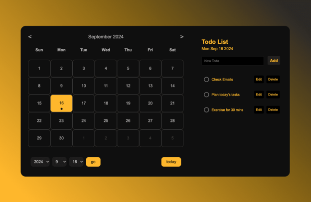

# Task Calendar App

一個結合行事曆與待辦事項清單的網頁應用，增加了日期選擇及更友善的 UI 操作功能，作為自主練習項目以提升前端開發技能。  
A web application that combines a calendar and a to-do list, with enhanced date selection and a more user-friendly UI. Created as a self-practice project to enhance front-end development skills.

## 目錄 / Table of Contents

- [Task Calendar App](#task-calendar-app)
  - [目錄 / Table of Contents](#目錄--table-of-contents)
  - [功能特點 / Features](#功能特點--features)
    - [🔍 概覽 Overview](#-概覽-overview)
    - [Links](#links)
    - [🔍 技術概覽 / Technical Overview](#-技術概覽--technical-overview)
    - [📝 待辦事項管理 To-Do Management](#-待辦事項管理-to-do-management)
    - [📅 日期選擇與操作 Date Selection \& Navigation](#-日期選擇與操作-date-selection--navigation)
    - [📁 資料儲存 Data Storage](#-資料儲存-data-storage)

## 功能特點 / Features

### 🔍 概覽 Overview

- 此項目支援 RWD 技術，可在桌面和手機設備上運行，隨時隨地管理代辦事項。  
   This project is optimized with RWD (Responsive Web Design) technology, making it usable on both desktop and mobile devices for task management anytime, anywhere.

### Links

- Live Site URL: [Task Calendar](https://kaiens-lab.github.io/Task-Calendar/)

---

### 🔍 技術概覽 / Technical Overview

- **JavaScript**
- **HTML5**
- **DOM**
- **CSS3**
- **RWD**
- **ES6+（ECMAScript 6+）**
- **Local Storage**

---

### 📝 待辦事項管理 To-Do Management

- 為選定日期新增、編輯、刪除及標記完成待辦事項。  
   Add, edit, delete, and mark tasks as completed for selected dates.

- 未完成的事項自動排在前面，讓管理更有效率。  
   Incomplete tasks are automatically sorted to the front for more efficient management.

---

### 📅 日期選擇與操作 Date Selection & Navigation

- 支援前後月顯示，使用者可以瀏覽並選擇其他月份的日期。  
   Supports displaying previous and next month's dates, allowing users to navigate and select other months.

- 新增日期搜索功能，使用下拉選單快速選擇年份、月份和日期。  
   Added date search functionality with dropdown menus for quickly selecting year, month, and date.

- "Today" 按鈕能快速跳轉到今天的日期，提供更友善的操作體驗。  
   The "Today" button allows users to quickly jump to the current date for a more user-friendly experience.

---

### 📁 資料儲存 Data Storage

- 使用瀏覽器的 localStorage 來保存待辦事項，確保資料在頁面刷新後不會丟失。  
   Uses browser localStorage to save tasks, ensuring data persists after page refresh.

---
